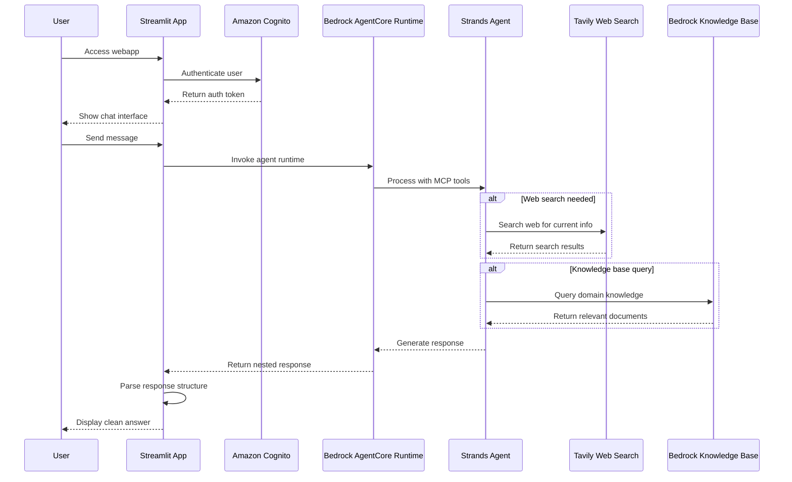

# Strands AgentCore App

A secure AI chat interface with real-time web search and knowledge base access, built with Amazon Bedrock AgentCore Runtime and Strands SDK.

## 🎯 Overview

**Secure AI Chat with Enhanced Capabilities:**
- 🔐 **Cognito Authentication** - Secure login with persistent sessions
- 🤖 **AI Conversations** - Powered by Bedrock AgentCore Runtime
- 🔍 **Real-time Web Search** - Current information via Tavily API
- 📚 **Knowledge Base Access** - Domain-specific queries using Bedrock Knowledge Base
- ⚡ **Modular Architecture** - Separated external and internal data sourcing

## 📸 Screenshots

### App Login


### Q&A in Action


## 🏗️ Architecture

### Core Technologies
- **Amazon Bedrock AgentCore Runtime**: Serverless AI agent hosting with microVM isolation
- **Strands SDK**: Framework-agnostic agent development with modular MCP tool integration
- **Amazon Cognito**: User authentication with persistent session management
- **Streamlit**: Interactive web interface with real-time chat updates
- **Modular Tools**: Separated external (Tavily Web Search) and internal (Bedrock Knowledge Base) data sourcing

### Data Flow


## 🚀 Quick Start

### Prerequisites
- Python 3.8+, Docker Desktop, AWS CLI
- AWS Profile: `CloudChef01` with Bedrock AgentCore permissions
- Valid Cognito credentials

### Installation
```bash
# Navigate to project
cd /Users/mba/Desktop/strands-agentcore-app-20250917

# Activate environment and install dependencies
source venv/bin/activate
pip install -r requirements.txt

# Configure environment variables
cp .env.example .env
# Edit .env with your actual values

# Start the application
./start_env_app.sh
```

**Access**: http://localhost:8501

## 🎯 Usage Examples

1. **Login**: Use Cognito credentials to authenticate
2. **Current Events**: "What's happening in AI today?" *(uses web_search_tool.py)*
3. **Technical Questions**: "Explain AWS Lambda concisely" *(uses knowledge_base_tool.py)*
4. **Knowledge Queries**: Domain-specific questions *(uses knowledge_base_tool.py)*
5. **Session Persistence**: Refresh page - stay logged in!

## 🔧 Configuration

### Environment Variables
```bash
# AWS & AgentCore
AWS_PROFILE=CloudChef01
AWS_REGION=us-east-1
AGENT_RUNTIME_ARN=arn:aws:bedrock-agentcore:us-east-1:111735445051:runtime/StrandsAgentCoreApp20250917-I3867LFr4j
KNOWLEDGE_BASE_ID=VVJWR6EQPY

# Cognito Authentication
COGNITO_USER_POOL_ID=us-east-1_LyhSJXjeF
COGNITO_CLIENT_ID=2kiuoifa3ulekjbtdj4tngkt7h
COGNITO_USERNAME=your_username_here
COGNITO_PASSWORD=your_password_here

# External APIs
TAVILY_API_KEY=your_tavily_api_key_here
```

## 🚀 Deployment

### Automated Deployment
```bash
python deploy_agentcore_v2.py
```

### Manual Runtime Creation
1. **AWS Console** → Bedrock → AgentCore → Create Runtime
2. **Name**: `StrandsAgentCoreApp20250917`
3. **Container URI**: `111735445051.dkr.ecr.us-east-1.amazonaws.com/strands-agentcore-app-20250917:latest`
4. **Environment Variables**: Set `TAVILY_API_KEY` and `KNOWLEDGE_BASE_ID`

**Detailed Steps**: See `MANUAL_RUNTIME_CREATION.md`

## 🧪 Testing & Troubleshooting

### Test Commands
```bash
python test_deployed_agent.py      # Test agent connectivity
python test_cognito_auth.py        # Test authentication
python test_response_parsing.py    # Test response parsing
```

### Common Issues
- **Authentication Failed**: Check Cognito credentials in `.env`
- **Runtime ARN Error**: Verify environment variable is set correctly
- **Session Not Persisting**: Check browser allows URL parameters
- **Module Import Error**: Ensure virtual environment is activated

## 🔍 Implementation Details

### Modular Agent Architecture
```python
# agent.py - Main agent with separated data sourcing
import os
import json
import logging
from typing import Dict, Any
from strands import Agent
from bedrock_agentcore.runtime import BedrockAgentCoreApp
from web_search_tool import web_search
from knowledge_base_tool import knowledge_search

# Configure logging
logging.basicConfig(level=logging.INFO)
logger = logging.getLogger(__name__)

# Set environment for tool consent
os.environ["BYPASS_TOOL_CONSENT"] = "true"

# Initialize BedrockAgentCoreApp
app = BedrockAgentCoreApp()

# Initialize Strands agent with separated external and internal data sourcing tools
agent = Agent(
    tools=[web_search, knowledge_search],
    system_prompt="You are a helpful AI assistant. Provide concise, accurate, and direct answers. Use tools when needed for current information or specific knowledge. Keep responses brief while maintaining factual accuracy."
)

@app.entrypoint
def invoke(payload: Dict[str, Any]) -> Dict[str, Any]:
    """Process user input and return a response"""
    try:
        user_message = payload.get("prompt", "Hello")
        session_id = payload.get("session_id", "default-session")
        memory_id = payload.get("memory_id", "helloworldmemory")
        
        logger.info(f"Processing: {user_message}")
        
        # Process with Strands agent (now with separated external and internal tools)
        result = agent(user_message)
        
        return {
            "response": {
                "role": "assistant",
                "content": [{"text": result.message}]
            },
            "session_id": session_id,
            "memory_id": memory_id,
            "status": "success"
        }
        
    except Exception as e:
        logger.error(f"Error: {e}")
        return {
            "error": str(e),
            "session_id": payload.get("session_id", "unknown"),
            "status": "error"
        }
```

### External Data Sourcing
```python
# web_search_tool.py - Tavily web search for current information
import os
import requests
import logging
from strands import tool

logger = logging.getLogger(__name__)

@tool
def web_search(query: str) -> str:
    """
    Search the web for current information using Tavily.
    Use this when you need up-to-date information, news, or facts.
    """
    api_key = os.getenv('TAVILY_API_KEY', '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')
    
    if not api_key:
        return "Web search is not available (no API key configured)."
    
    try:
        url = "https://api.tavily.com/search"
        payload = {
            "api_key": api_key,
            "query": query,
            "search_depth": "basic",
            "include_answer": True,
            "include_images": False,
            "include_raw_content": False,
            "max_results": 3
        }
        
        logger.info(f"Searching Tavily for: {query}")
        response = requests.post(url, json=payload, timeout=10)
        response.raise_for_status()
        
        data = response.json()
        
        # Format results
        results = []
        
        # Add direct answer if available
        if data.get('answer'):
            results.append(f"**Answer:** {data['answer']}")
        
        # Add search results
        if data.get('results'):
            results.append("**Sources:**")
            for i, result in enumerate(data['results'][:3], 1):
                title = result.get('title', 'No title')
                content = result.get('content', 'No content')
                url = result.get('url', 'No URL')
                
                # Truncate content if too long
                if len(content) > 150:
                    content = content[:150] + "..."
                
                results.append(f"{i}. {title}")
                results.append(f"   {content}")
                results.append(f"   {url}")
        
        return "\n".join(results) if results else "No search results found."
        
    except Exception as e:
        logger.error(f"Tavily search error: {e}")
        return f"Search failed: {str(e)}"
```

### Internal Data Sourcing
```python
# knowledge_base_tool.py - Bedrock Knowledge Base for domain knowledge
import os
import logging
import boto3
from strands import tool

logger = logging.getLogger(__name__)

@tool
def knowledge_search(query: str) -> str:
    """
    Search company knowledge base for internal information.
    Use this for company policies, procedures, documentation, and internal knowledge.
    """
    knowledge_base_id = os.getenv('BEDROCK_KB_ID', 'VVJWR6EQPY')
    
    try:
        session = boto3.Session(profile_name="CloudChef01")
        client = session.client('bedrock-agent-runtime', region_name='us-east-1')
        
        logger.info(f"Searching Knowledge Base {knowledge_base_id} for: {query}")
        
        response = client.retrieve_and_generate(
            input={'text': query},
            retrieveAndGenerateConfiguration={
                'type': 'KNOWLEDGE_BASE',
                'knowledgeBaseConfiguration': {
                    'knowledgeBaseId': knowledge_base_id,
                    'modelArn': 'arn:aws:bedrock:us-east-1::foundation-model/anthropic.claude-3-haiku-20240307-v1:0'
                }
            }
        )
        
        return response['output']['text']
        
    except Exception as e:
        logger.error(f"Knowledge base search error: {e}")
        return f"Knowledge search failed: {str(e)}"
```

### Authentication & Sessions
```python
# streamlit_app/app_env.py - Cognito authentication with persistent sessions
import streamlit as st
import boto3
import json
import os
from dotenv import load_dotenv
import base64
import time

def authenticate_user(username, password):
    """Authenticate user with AWS Cognito"""
    try:
        client = boto3.client('cognito-idp', region_name=os.getenv('AWS_REGION', 'us-east-1'))
        
        response = client.initiate_auth(
            ClientId=os.getenv('COGNITO_CLIENT_ID'),
            AuthFlow='USER_PASSWORD_AUTH',
            AuthParameters={
                'USERNAME': username,
                'PASSWORD': password
            }
        )
        
        if response.get('AuthenticationResult'):
            return True, response['AuthenticationResult']
        return False, None
        
    except Exception as e:
        return False, str(e)

def set_persistent_session(email):
    """Set persistent session using URL parameters"""
    auth_token = base64.b64encode(f"{email}:{int(time.time())}".encode()).decode()
    st.query_params.auth_token = auth_token
    st.query_params.user = email

def call_agent(prompt, session_id):
    """Call the deployed Strands agent"""
    try:
        agent_runtime_arn = os.getenv('AGENT_RUNTIME_ARN')
        if not agent_runtime_arn:
            return "Error: AGENT_RUNTIME_ARN environment variable not set"
        
        client = boto3.client('bedrock-agentcore', region_name=os.getenv('AWS_REGION'))
        
        payload = json.dumps({"prompt": prompt, "session_id": session_id})
        
        response = client.invoke_agent_runtime(
            agentRuntimeArn=agent_runtime_arn,
            runtimeSessionId=session_id,
            payload=payload
        )
        
        response_body = response['response'].read()
        response_data = json.loads(response_body)
        
        # Parse deeply nested response structure
        if (response_data.get('status') == 'success' and
            'response' in response_data and
            'content' in response_data['response'] and
            len(response_data['response']['content']) > 0 and
            'text' in response_data['response']['content'][0] and
            isinstance(response_data['response']['content'][0]['text'], dict) and
            'content' in response_data['response']['content'][0]['text'] and
            len(response_data['response']['content'][0]['text']['content']) > 0 and
            'text' in response_data['response']['content'][0]['text']['content'][0]):
            
            return response_data['response']['content'][0]['text']['content'][0]['text']
        
        return "Failed to extract text from deeply nested response"
            
    except Exception as e:
        return f"Error: {str(e)}"
```

## 📁 Project Structure

```
strands-agentcore-app-20250917/
├── README.md                        # Project documentation
├── MANUAL_RUNTIME_CREATION.md       # Runtime creation guide
├── screenshots/                     # App screenshots
├── streamlit_app/
│   └── app_env.py                  # Main Streamlit app with Cognito auth
├── agent.py                        # Strands agent with modular data sourcing
├── web_search_tool.py              # External data sourcing (Tavily/MCP)
├── knowledge_base_tool.py          # Internal data sourcing (Bedrock KB/RAG)
├── Dockerfile                      # Container configuration
├── requirements.txt                # Python dependencies
├── deploy_agentcore_v2.py          # Deployment automation
├── start_env_app.sh               # Startup script
├── test_deployed_agent.py         # Agent connectivity testing
├── test_cognito_auth.py           # Authentication testing
├── test_response_parsing.py       # Response parsing validation
├── .env.example                   # Environment template
├── .env                           # Local environment variables
├── .gitignore                     # Git exclusions
└── venv/                          # Python virtual environment
```

## 📝 Version History

- **v4.0** (2025-09-28): Modular architecture with separated data sourcing tools, codebase cleanup
- **v3.0** (2025-01-28): Cognito authentication, persistent sessions, concise responses
- **v2.0** (2025-01-28): Environment-based configuration, updated naming
- **v1.0** (2025-01-28): Working implementation with response parsing

## 🔗 Resources

- [Amazon Bedrock AgentCore Documentation](https://docs.aws.amazon.com/bedrock-agentcore/)
- [Amazon Cognito Documentation](https://docs.aws.amazon.com/cognito/)
- [Streamlit Documentation](https://docs.streamlit.io/)
- [Strands SDK Documentation](https://strandsagents.com/latest/documentation/docs/api-reference/agent/)
- [MCP (Model Context Protocol)](https://modelcontextprotocol.io/)

## 📄 License

MIT License - Feel free to use and modify for your projects!
