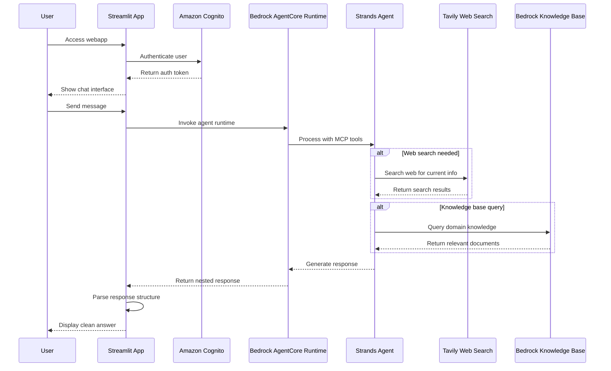
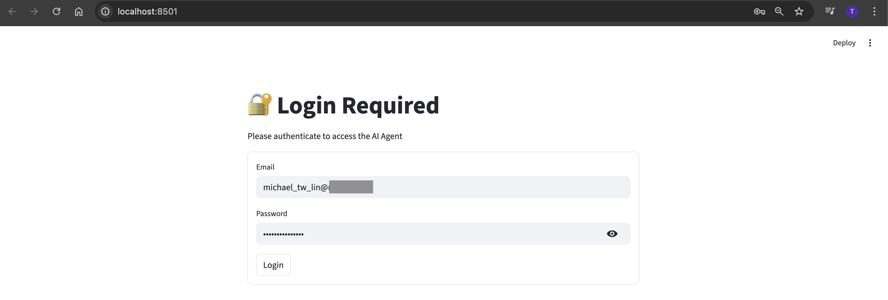
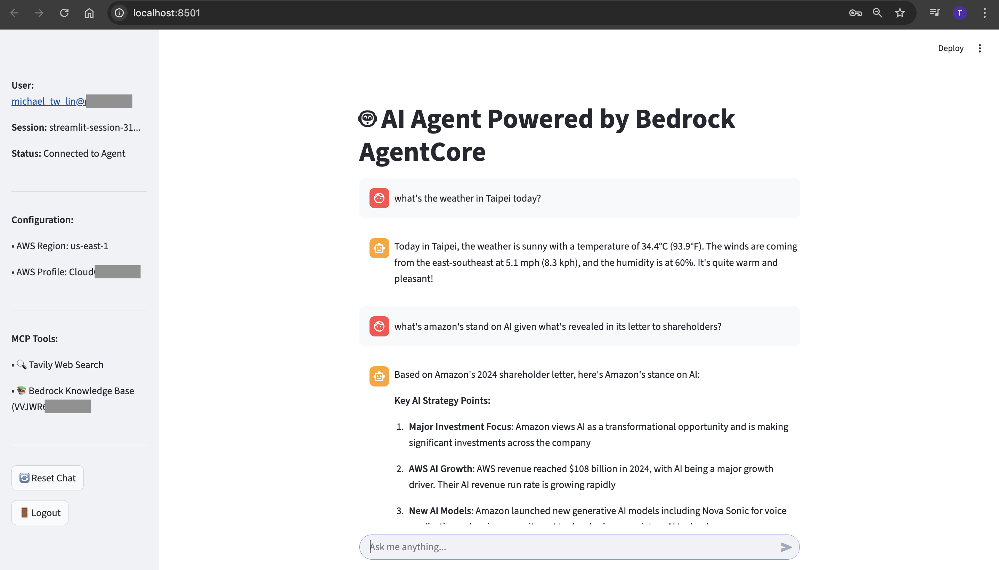

# AI Agent Powered by Bedrock AgentCore

A secure, intelligent chat interface that combines AI conversations with real-time web search and knowledge base access, built with Streamlit and Amazon Bedrock AgentCore Runtime.

## 📋 What This App Does

**Secure AI Chat with Enhanced Capabilities:**
- 🔐 **Cognito Authentication** - Secure login with persistent sessions
- 🤖 **AI Conversations** - Powered by Bedrock AgentCore Runtime with Strands SDK
- 🔍 **Real-time Web Search** - Current information via Tavily API
- 📚 **Knowledge Base Access** - Domain-specific queries using Bedrock Knowledge Base
- ⚡ **Concise Responses** - Optimized for direct, factual answers

**Perfect for**: Research assistance, current events, technical questions, and scenarios requiring both real-time web data and curated knowledge.

## 🏗️ Architecture & Technology Stack



### Core Technologies
- **Amazon Bedrock AgentCore Runtime**: Serverless AI agent hosting with microVM isolation and 8-hour execution time
- **Strands SDK**: Framework-agnostic agent development with modular MCP tool integration
- **Amazon Cognito**: User authentication with persistent session management
- **Streamlit**: Interactive web interface with real-time chat updates
- **Modular Tools**: Separated external (Tavily Web Search) and internal (Bedrock Knowledge Base ID: VVJWR6EQPY) data sourcing

## 📸 Screenshots

### App Login


### Q&A in Action


## 🚀 Quick Start

### Prerequisites
- Python 3.8+, Docker Desktop, AWS CLI
- AWS Profile: `CloudChef01` with Bedrock AgentCore permissions
- Valid Cognito credentials

### Installation & Setup
```bash
# Navigate to project
cd /Users/mba/Desktop/strands-agentcore-app-20250917

# Activate environment and install dependencies
source venv/bin/activate
pip install -r requirements.txt

# Configure environment variables
cp .env.example .env
# Edit .env with your actual values

# Start the application
./start_env_app.sh
```

**Access**: http://localhost:8501

## 🔧 Configuration

### Runtime Configuration
- **Runtime ARN**: `arn:aws:bedrock-agentcore:us-east-1:111735445051:runtime/StrandsAgentCoreApp20250917-I3867LFr4j`
- **Container**: `111735445051.dkr.ecr.us-east-1.amazonaws.com/strands-agentcore-app-20250917:latest`
- **Knowledge Base**: `VVJWR6EQPY`

### Environment Variables
```bash
# AWS & AgentCore
AWS_PROFILE=CloudChef01
AWS_REGION=us-east-1
AGENT_RUNTIME_ARN=arn:aws:bedrock-agentcore:us-east-1:111735445051:runtime/StrandsAgentCoreApp20250917-I3867LFr4j
KNOWLEDGE_BASE_ID=VVJWR6EQPY

# Cognito Authentication
COGNITO_USER_POOL_ID=us-east-1_LyhSJXjeF
COGNITO_CLIENT_ID=2kiuoifa3ulekjbtdj4tngkt7h
COGNITO_USERNAME=your_username_here
COGNITO_PASSWORD=your_password_here
```

## 🚀 Deployment

### Automated Process
```bash
python deploy_agentcore_v2.py
```

**Steps**: ECR repository creation → Docker build/push → Manual runtime creation via AWS Console

### Manual Runtime Creation
1. **AWS Console** → Bedrock → AgentCore → Create Runtime
2. **Name**: `StrandsAgentCoreApp20250917`
3. **Container URI**: `111735445051.dkr.ecr.us-east-1.amazonaws.com/strands-agentcore-app-20250917:latest`
4. **Environment Variables**: `TAVILY_API_KEY`, `BEDROCK_KNOWLEDGE_BASE_ID`

**Detailed Steps**: See `MANUAL_RUNTIME_CREATION.md` for complete runtime setup instructions

## 🔍 Key Implementation Details

### Strands Agent with Modular Data Sourcing
```python
# agent.py - Strands agent with separated external and internal data sourcing
from strands import Agent
from web_search_tool import web_search
from knowledge_base_tool import knowledge_search

agent = Agent(
    tools=[web_search, knowledge_search],
    system_prompt="You are a helpful AI assistant. Provide concise, accurate, and direct answers. Use tools when needed for current information or specific knowledge. Keep responses brief while maintaining factual accuracy."
)
```

### External Data Sourcing (Tavily/MCP)
```python
# web_search_tool.py - Web search for current/external information
@tool
def web_search(query: str) -> str:
    """
    Search the web for current information using Tavily.
    Use this when you need up-to-date information, news, or facts.
    """
    api_key = os.getenv('TAVILY_API_KEY')
    url = "https://api.tavily.com/search"
    payload = {
        "api_key": api_key,
        "query": query,
        "search_depth": "basic",
        "include_answer": True,
        "max_results": 3
    }
    # Returns formatted web search results
```

### Internal Data Sourcing (Bedrock Knowledge Base/RAG)
```python
# knowledge_base_tool.py - Knowledge Base search for internal/company information
@tool
def knowledge_search(query: str) -> str:
    """
    Search company knowledge base for internal information.
    Use this for company policies, procedures, documentation, and internal knowledge.
    """
    knowledge_base_id = os.getenv('BEDROCK_KB_ID', 'VVJWR6EQPY')
    
    session = boto3.Session(profile_name="CloudChef01")
    client = session.client('bedrock-agent-runtime', region_name='us-east-1')
    
    response = client.retrieve_and_generate(
        input={'text': query},
        retrieveAndGenerateConfiguration={
            'type': 'KNOWLEDGE_BASE',
            'knowledgeBaseConfiguration': {
                'knowledgeBaseId': knowledge_base_id,
                'modelArn': 'arn:aws:bedrock:us-east-1::foundation-model/anthropic.claude-3-haiku-20240307-v1:0'
            }
        }
    )
    
    return response['output']['text']
```

### Cognito Authentication & Persistent Sessions
```python
# streamlit_app/app_env.py - Authentication and session management
def authenticate_user(username, password):
    client = boto3.client('cognito-idp', region_name=os.getenv('AWS_REGION'))
    response = client.initiate_auth(
        ClientId=os.getenv('COGNITO_CLIENT_ID'),
        AuthFlow='USER_PASSWORD_AUTH',
        AuthParameters={'USERNAME': username, 'PASSWORD': password}
    )
    return response.get('AuthenticationResult') is not None

def set_persistent_session(email):
    auth_token = base64.b64encode(f"{email}:{int(time.time())}".encode()).decode()
    st.query_params.auth_token = auth_token
    st.query_params.user = email
```

### AgentCore Response Parsing
```python
# streamlit_app/app_env.py - Extract from deeply nested structure
return response_data['response']['content'][0]['text']['content'][0]['text']
```

## 🧪 Testing & Troubleshooting

### Test Commands
```bash
python test_deployed_agent.py      # Test agent connectivity
python test_cognito_auth.py        # Test authentication
```

### Common Issues
- **Authentication Failed**: Check Cognito credentials in `.env`
- **Runtime ARN Error**: Verify environment variable is set correctly
- **Session Not Persisting**: Check browser allows URL parameters

## 📁 Project Structure

```
strands-agentcore-app-20250917/
├── README.md                        # Project documentation
├── MANUAL_RUNTIME_CREATION.md       # Runtime creation guide
├── screenshots/                     # App screenshots
│   ├── screenshot_1.png            # App Login
│   └── screenshot_2.png            # Q&A in Action
├── streamlit_app/
│   └── app_env.py                  # Main Streamlit app with Cognito auth
├── agent.py                        # Strands agent with modular data sourcing
├── web_search_tool.py              # External data sourcing (Tavily/MCP)
├── knowledge_base_tool.py          # Internal data sourcing (Bedrock KB/RAG)
├── Dockerfile                      # Container configuration
├── requirements.txt                # Python dependencies
├── deploy_agentcore_v2.py          # Deployment automation
├── start_env_app.sh               # Startup script
├── test_deployed_agent.py         # Agent testing
├── test_cognito_auth.py           # Authentication testing
├── test_response_parsing.py       # Response parsing validation
├── .env.example                   # Environment template
├── .env                           # Local environment variables
├── .gitignore                     # Git exclusions
└── venv/                          # Python virtual environment
```

## 🎯 Usage Examples

1. **Login**: Use Cognito credentials to authenticate
2. **Current Events**: "What's happening in AI today?" *(uses web_search_tool.py)*
3. **Technical Questions**: "Explain AWS Lambda concisely" *(uses knowledge_base_tool.py)*
4. **Knowledge Queries**: Domain-specific questions using configured KB *(uses knowledge_base_tool.py)*
5. **Session Persistence**: Refresh page - stay logged in!

## 🧪 Testing & Troubleshooting

### Test Commands
```bash
python test_deployed_agent.py      # Test agent connectivity
python test_cognito_auth.py        # Test authentication
python test_response_parsing.py    # Test response parsing
```

### Common Issues
- **Authentication Failed**: Check Cognito credentials in `.env`
- **Runtime ARN Error**: Verify environment variable is set correctly
- **Session Not Persisting**: Check browser allows URL parameters
- **Module Import Error**: Ensure virtual environment is activated

## 📝 Version History

- **v4.0** (2025-09-28): Modular architecture with separated data sourcing tools, codebase cleanup
- **v3.0** (2025-01-28): Cognito authentication, persistent sessions, concise responses
- **v2.0** (2025-01-28): Environment-based configuration, updated naming
- **v1.0** (2025-01-28): Working implementation with response parsing

## 🔗 Resources

- [Amazon Bedrock AgentCore Documentation](https://docs.aws.amazon.com/bedrock-agentcore/)
- [Amazon Cognito Documentation](https://docs.aws.amazon.com/cognito/)
- [Streamlit Documentation](https://docs.streamlit.io/)
- [MCP (Model Context Protocol)](https://modelcontextprotocol.io/)
