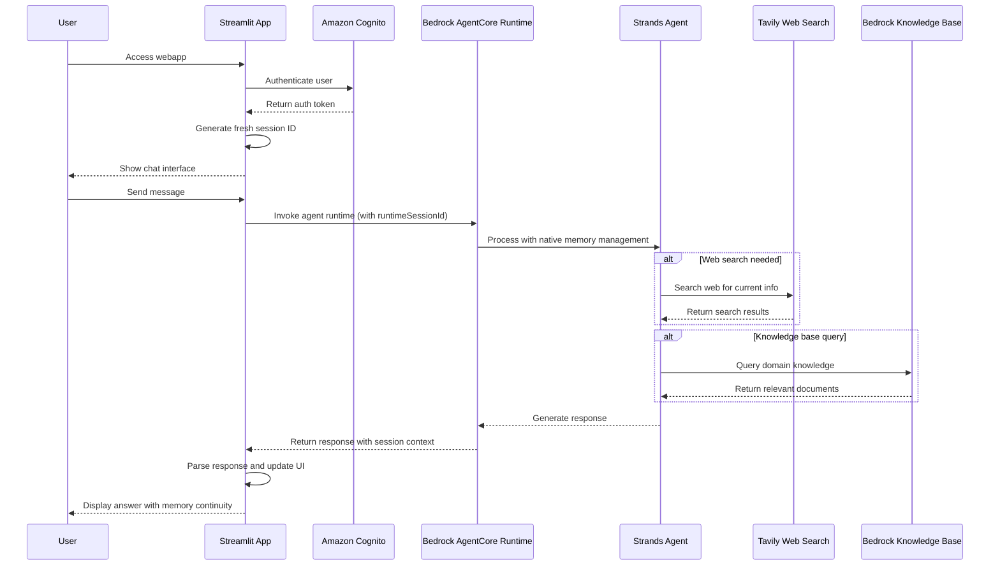

# Strands AgentCore App

A secure AI chat interface with real-time web search and knowledge base access, built with Amazon Bedrock AgentCore Runtime and Strands SDK.

## 🎯 Overview

**Secure AI Chat with Enhanced Capabilities:**
- 🔐 **Cognito Authentication** - Secure login with persistent sessions
- 🤖 **AI Conversations** - Powered by Bedrock AgentCore Runtime
- 🔍 **Real-time Web Search** - Current information via Tavily API
- 📚 **Knowledge Base Access** - Domain-specific queries using Bedrock Knowledge Base
- ⚡ **Modular Architecture** - Separated external and internal data sourcing

## 📸 Screenshots

### App Login


### Q&A in Action


## 🏗️ Architecture

### Core Technologies
- **Amazon Bedrock AgentCore Runtime**: Serverless AI agent hosting with microVM isolation
- **Strands SDK**: Framework-agnostic agent development with modular MCP tool integration
- **Amazon Cognito**: User authentication with persistent session management
- **Streamlit**: Interactive web interface with real-time chat updates
- **Modular Tools**: Separated external (Tavily Web Search) and internal (Bedrock Knowledge Base) data sourcing

### SDK Integration & Value Proposition

#### 🤖 **Strands SDK - Agent Development Framework**
**What it provides:**
- **Agent Definition**: `Agent()` class for creating conversational AI agents
- **Tool Integration**: `@tool` decorator for seamless MCP tool integration
- **Framework Agnostic**: Works with any deployment platform (not tied to AWS)
- **Modular Architecture**: Clean separation between agent logic and tools

**In this app:**
```python
# Agent creation with tools
agent = Agent(
    tools=[web_search, knowledge_search],
    system_prompt="You are a helpful AI assistant..."
)

# Tool definition
@tool
def web_search(query: str) -> str:
    # External data sourcing via Tavily API
```

**Value:** Provides the **agent intelligence and tool orchestration** - the "brain" of the application.

#### ☁️ **Bedrock AgentCore Runtime - Serverless Deployment Platform**
**What it provides:**
- **Serverless Hosting**: Deploy agents without managing infrastructure
- **MicroVM Isolation**: Secure, isolated execution environment
- **Auto-scaling**: Handles concurrent users automatically
- **Memory Management**: Built-in conversation context via `runtimeSessionId`
- **AWS Integration**: Native integration with AWS services

**In this app:**
```python
# Deployment wrapper
app = BedrockAgentCoreApp()

@app.entrypoint
def invoke(payload: Dict[str, Any]) -> Dict[str, Any]:
    # AgentCore handles: scaling, isolation, memory, AWS integration
    result = agent(user_message)  # Strands handles: intelligence, tools
```

**Value:** Provides **production-ready deployment and scaling** - the "infrastructure" of the application.

#### 🔄 **Why Both SDKs Together Create Superior Value**

| Feature | Strands SDK | AgentCore Runtime | Combined Benefit |
|---------|-------------|-------------------|------------------|
| **Agent Logic** | ✅ Core intelligence | ❌ Not provided | **Smart agents with clean code** |
| **Tool Integration** | ✅ MCP framework | ❌ Not provided | **Modular, reusable tools** |
| **Serverless Hosting** | ❌ Not provided | ✅ Auto-scaling | **Production deployment** |
| **Memory Management** | ❌ Basic only | ✅ Session-based | **Stateful conversations** |
| **AWS Integration** | ❌ Not provided | ✅ Native support | **Enterprise-ready security** |
| **Multi-tenancy** | ❌ Not provided | ✅ Automatic isolation | **Safe concurrent users** |

#### 🎯 **The Perfect Partnership**
- **Strands SDK**: Handles the **"what"** - agent intelligence, tool orchestration, conversation logic
- **AgentCore Runtime**: Handles the **"how"** - deployment, scaling, security, memory, AWS integration
- **Together**: Create **production-ready, intelligent agents** that scale automatically while maintaining clean, modular code

**Without Strands**: You'd need custom tool integration and agent logic
**Without AgentCore**: You'd need custom deployment, scaling, and memory management
**With Both**: You get enterprise-grade AI agents with minimal infrastructure complexity

### Data Flow


## ⚡ Enhanced Agent Intelligence

### Autonomous Reasoning System Prompt
The app uses an advanced system prompt that enables multi-step reasoning and autonomous tool selection:

```python
system_prompt="""You are an intelligent research assistant with autonomous reasoning capabilities.

For each query:
1. Analyze if you need current information (use web_search)
2. Check if domain knowledge is needed (use knowledge_search)  
3. For complex topics, use BOTH tools to cross-validate information
4. Think step-by-step and explain your reasoning
5. Provide comprehensive, well-researched responses

Always be thorough but concise. Use multiple tools when beneficial."""
```

This enhancement transforms the agent from basic Q&A to intelligent research assistant with:
- **Multi-tool coordination** for cross-validated information
- **Step-by-step reasoning** with transparent logic  
- **Autonomous decision making** for intelligent processing
- **Comprehensive research** delivering higher accuracy

## 🚀 Quick Start & Configuration

### Prerequisites
- Python 3.8+, Docker Desktop, AWS CLI
- AWS Profile: `your_aws_profile` with Bedrock AgentCore permissions
- Valid Cognito credentials

### Step 1: Environment Setup & Configuration
```bash
# Navigate to project
cd /Users/mba/Desktop/strands-agentcore-app-20250917

# Create and activate virtual environment
python -m venv venv
source venv/bin/activate

# Install dependencies
pip install -r requirements.txt

# Configure environment variables
cp .env.example .env
```

**Edit `.env` file with your configuration:**
```bash
# AWS & AgentCore
AWS_PROFILE=your_aws_profile_name
AWS_REGION=your_aws_region
KNOWLEDGE_BASE_ID=your_knowledge_base_id

# Cognito Authentication
COGNITO_USER_POOL_ID=your_cognito_user_pool_id
COGNITO_CLIENT_ID=your_cognito_client_id
COGNITO_USERNAME=your_username_here
COGNITO_PASSWORD=your_password_here

# External APIs
TAVILY_API_KEY=your_tavily_api_key_here

# Note: AGENT_RUNTIME_ARN will be set after Step 2 deployment
```

### Step 2: Deploy Infrastructure to AWS (First Time Only)
```bash
# Deploy AgentCore runtime to AWS cloud
python deploy_agentcore_v2.py
```

**What this does:**
- 🏗️ **Creates ECR repository** (if doesn't exist)
- 🐳 **Builds Docker image** from your agent code
- ☁️ **Pushes image to AWS ECR** (container registry)
- 🤖 **Creates AgentCore runtime** in AWS Bedrock
- 📋 **Returns runtime ARN** for configuration

**After deployment, update your `.env` file:**
```bash
# Add the runtime ARN from deployment output
echo "AGENT_RUNTIME_ARN=arn:aws:bedrock-agentcore:your_aws_region:your_account_id:runtime/YourRuntimeName" >> .env
```

### Step 3: Start Local Web Interface
```bash
# Start the Streamlit web application
./start_env_app.sh
```

**What this does:**
- ✅ **Validates environment** and dependencies
- 🌐 **Starts Streamlit web app** on http://localhost:8503
- 🔗 **Connects to deployed AgentCore runtime** via AGENT_RUNTIME_ARN

**Access**: http://localhost:8503

### Daily Usage (After Initial Setup)
```bash
# Just start the web interface - no redeployment needed
./start_env_app.sh
```

**Note**: Only redeploy with `python deploy_agentcore_v2.py` when you modify the agent code (agent.py, web_search_tool.py, knowledge_base_tool.py).

## 🎯 Usage Examples

1. **Login**: Use Cognito credentials to authenticate
2. **Current Events**: "What's happening in AI today?" *(uses web_search_tool.py)*
3. **Technical Questions**: "Explain AWS Lambda concisely" *(uses knowledge_base_tool.py)*
4. **Knowledge Queries**: Domain-specific questions *(uses knowledge_base_tool.py)*
5. **Session Persistence**: Refresh page - stay logged in!

## 🚀 Deployment Details

### Two Types of Operations

#### 1. Infrastructure Deployment (One-Time Setup)
```bash
python deploy_agentcore_v2.py
```

**What it does**:
- 📦 Creates ECR repository for container images
- 🐳 Builds Docker image with your agent code
- ☁️ Pushes image to AWS ECR
- 🤖 Creates AgentCore runtime in AWS Bedrock
- 📋 Returns runtime ARN for configuration

**When to run**:
- ✅ First time setup
- ✅ When you modify agent code (agent.py, web_search_tool.py, knowledge_base_tool.py)
- ✅ When updating dependencies or Dockerfile

**Output**: You'll get a runtime ARN to add to your `.env` file

#### 2. Local Application Startup (Daily Usage)
```bash
./start_env_app.sh
```

**What it does**:
- ✅ Activates virtual environment
- ✅ Validates environment variables
- 🌐 Starts Streamlit web app on http://localhost:8503
- 🔗 Connects to your deployed AgentCore runtime

**When to run**:
- ✅ Every time you want to use the app
- ✅ After restarting your computer
- ✅ For testing and daily interaction

**Requirements**: Must have completed infrastructure deployment first

### Manual Runtime Creation (Alternative)
If automated deployment fails, you can create the runtime manually:

1. **AWS Console** → Bedrock → AgentCore → Create Runtime
2. **Name**: `StrandsAgentCoreApp20250917`
3. **Container URI**: `your_account_id.dkr.ecr.your_aws_region.amazonaws.com/strands-agentcore-app-20250917:latest`
4. **Environment Variables**: Set `TAVILY_API_KEY` and `KNOWLEDGE_BASE_ID`

**Detailed Steps**: See `MANUAL_RUNTIME_CREATION.md`

## 🧪 Testing & Troubleshooting

### Test Commands
```bash
python test_deployed_agent.py      # Test agent connectivity
python test_cognito_auth.py        # Test authentication
python test_response_parsing.py    # Test response parsing
```

### Common Issues
- **Authentication Failed**: Check Cognito credentials in `.env`
- **Runtime ARN Error**: Verify environment variable is set correctly
- **Session Not Persisting**: Check browser allows URL parameters
- **Module Import Error**: Ensure virtual environment is activated

## 📊 Built-in Observability

### Basic Monitoring (No Setup Required)
Your app automatically gets basic monitoring through AgentCore Runtime:

- **📈 Runtime Metrics**: Invocation count, duration, error rates
- **🧠 Memory Metrics**: Session operations and performance  
- **🔧 Tool Metrics**: Tool usage and success rates
- **👥 User Metrics**: Session count and user activity

**View in CloudWatch**: Navigate to CloudWatch → Metrics → AWS/BedrockAgentCore

### Enhanced Monitoring (Setup Completed)
With CloudWatch Transaction Search configured, you also get:

- **🔍 End-to-end Tracing**: Complete request flows from Streamlit → AgentCore → Tools
- **📊 Searchable Spans**: Find issues by session ID, error codes, or latency
- **⚡ Performance Analysis**: Identify bottlenecks and optimization opportunities
- **🎯 GenAI Dashboard**: Specialized AI agent monitoring and insights

**Access Enhanced Monitoring**:
- CloudWatch → Application Signals (APM) → Transaction Search
- CloudWatch → GenAI Observability → AgentCore Metrics
- X-Ray Console → Traces → Search by session ID or error status

## 🔍 Implementation Details

### Modular Agent Architecture
```python
# agent.py - Simplified agent with AgentCore native memory
import os
import json
import logging
from typing import Dict, Any
from strands import Agent
from bedrock_agentcore.runtime import BedrockAgentCoreApp
from web_search_tool import web_search
from knowledge_base_tool import knowledge_search

# Configure logging
logging.basicConfig(level=logging.INFO)
logger = logging.getLogger(__name__)

# Set environment for tool consent
os.environ["BYPASS_TOOL_CONSENT"] = "true"

# Initialize BedrockAgentCoreApp
app = BedrockAgentCoreApp()

# Initialize Strands agent with separated external and internal data sourcing tools
agent = Agent(
    tools=[web_search, knowledge_search],
    system_prompt="You are a helpful AI assistant with memory of our conversation. Provide concise, accurate, and direct answers. Use tools when needed for current information or specific knowledge. Reference previous conversation context when relevant."
)

@app.entrypoint
def invoke(payload: Dict[str, Any]) -> Dict[str, Any]:
    """Process user input with AgentCore native memory management"""
    try:
        user_message = payload.get("prompt", "Hello")
        session_id = payload.get("session_id", "default-session")
        
        logger.info(f"Processing message for session: {session_id[:20]}...")
        
        # Process with Strands agent - AgentCore handles memory via runtimeSessionId
        result = agent(user_message)
        
        return {
            "response": {
                "role": "assistant",
                "content": [{"text": result.message}]
            },
            "session_id": session_id,
            "status": "success"
        }
        
    except Exception as e:
        logger.error(f"Error processing message: {e}")
        return {
            "error": str(e),
            "session_id": payload.get("session_id", "unknown"),
            "status": "error"
        }
```

### External Data Sourcing
```python
# web_search_tool.py - Tavily web search for current information
import os
import requests
import logging
from strands import tool

logger = logging.getLogger(__name__)

@tool
def web_search(query: str) -> str:
    """
    Search the web for current information using Tavily.
    Use this when you need up-to-date information, news, or facts.
    """
    api_key = os.getenv('TAVILY_API_KEY', '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')
    
    if not api_key:
        return "Web search is not available (no API key configured)."
    
    try:
        url = "https://api.tavily.com/search"
        payload = {
            "api_key": api_key,
            "query": query,
            "search_depth": "basic",
            "include_answer": True,
            "include_images": False,
            "include_raw_content": False,
            "max_results": 3
        }
        
        logger.info(f"Searching Tavily for: {query}")
        response = requests.post(url, json=payload, timeout=10)
        response.raise_for_status()
        
        data = response.json()
        
        # Format results
        results = []
        
        # Add direct answer if available
        if data.get('answer'):
            results.append(f"**Answer:** {data['answer']}")
        
        # Add search results
        if data.get('results'):
            results.append("**Sources:**")
            for i, result in enumerate(data['results'][:3], 1):
                title = result.get('title', 'No title')
                content = result.get('content', 'No content')
                url = result.get('url', 'No URL')
                
                # Truncate content if too long
                if len(content) > 150:
                    content = content[:150] + "..."
                
                results.append(f"{i}. {title}")
                results.append(f"   {content}")
                results.append(f"   {url}")
        
        return "\n".join(results) if results else "No search results found."
        
    except Exception as e:
        logger.error(f"Tavily search error: {e}")
        return f"Search failed: {str(e)}"
```

### Internal Data Sourcing
```python
# knowledge_base_tool.py - Bedrock Knowledge Base for domain knowledge
import os
import logging
import boto3
from strands import tool

logger = logging.getLogger(__name__)

@tool
def knowledge_search(query: str) -> str:
    """
    Search company knowledge base for internal information.
    Use this for company policies, procedures, documentation, and internal knowledge.
    """
    knowledge_base_id = os.getenv('KNOWLEDGE_BASE_ID', 'your_knowledge_base_id')
    
    try:
        session = boto3.Session(profile_name="your_aws_profile")
        client = session.client('bedrock-agent-runtime', region_name=os.getenv('AWS_REGION'))
        
        logger.info(f"Searching Knowledge Base {knowledge_base_id} for: {query}")
        
        response = client.retrieve_and_generate(
            input={'text': query},
            retrieveAndGenerateConfiguration={
                'type': 'KNOWLEDGE_BASE',
                'knowledgeBaseConfiguration': {
                    'knowledgeBaseId': knowledge_base_id,
                    'modelArn': 'arn:aws:bedrock:your_aws_region::foundation-model/anthropic.claude-3-haiku-20240307-v1:0'
                }
            }
        )
        
        return response['output']['text']
        
    except Exception as e:
        logger.error(f"Knowledge base search error: {e}")
        return f"Knowledge search failed: {str(e)}"
```

### AgentCore Memory Management
```python
# agent.py - Simplified memory using AgentCore native capabilities
@app.entrypoint
def invoke(payload: Dict[str, Any]) -> Dict[str, Any]:
    """Process user input with AgentCore native memory management"""
    try:
        user_message = payload.get("prompt", "Hello")
        session_id = payload.get("session_id", "default-session")
        
        # AgentCore automatically handles memory via runtimeSessionId
        result = agent(user_message)
        
        return {
            "response": {"role": "assistant", "content": [{"text": result.message}]},
            "session_id": session_id,
            "status": "success"
        }
```

```python
# streamlit_app/app_env.py - Fresh session ID generation for memory isolation
def authenticate_user(username, password):
    if success:
        # Generate fresh session ID for new login (ensures memory isolation)
        st.session_state.session_id = f"session-{str(uuid.uuid4())}"
        st.session_state.messages = []  # Fresh conversation history
        st.session_state.authenticated = True

def call_agent(prompt, session_id):
    """Call agent with session context for memory continuity"""
    payload = json.dumps({"prompt": prompt, "session_id": session_id})
    
    response = client.invoke_agent_runtime(
        agentRuntimeArn=agent_runtime_arn,
        runtimeSessionId=session_id,  # AgentCore uses this for automatic memory isolation
        payload=payload
    )
```

**Memory Implementation:**
- **AgentCore Native**: Uses `runtimeSessionId` for automatic memory management
- **Session Isolation**: Each login generates unique session ID for complete isolation
- **Fresh Context**: New login = new session = clean memory slate
- **Zero Cross-Over**: Different session IDs = separate memory spaces
- **Automatic Persistence**: AgentCore maintains conversation context within session

**Memory Benefits:**
- **Simplified Code**: No custom memory management needed
- **Bulletproof Isolation**: AgentCore's built-in session isolation
- **Fresh Sessions**: Clean start for each login
- **Scalable**: Supports unlimited concurrent users safely

### Authentication & Sessions
```python
# streamlit_app/app_env.py - Cognito authentication with persistent sessions
import streamlit as st
import boto3
import json
import os
from dotenv import load_dotenv
import base64
import time

def authenticate_user(username, password):
    """Authenticate user with AWS Cognito"""
    try:
        client = boto3.client('cognito-idp', region_name=os.getenv('AWS_REGION', 'us-east-1'))
        
        response = client.initiate_auth(
            ClientId=os.getenv('COGNITO_CLIENT_ID'),
            AuthFlow='USER_PASSWORD_AUTH',
            AuthParameters={
                'USERNAME': username,
                'PASSWORD': password
            }
        )
        
        if response.get('AuthenticationResult'):
            return True, response['AuthenticationResult']
        return False, None
        
    except Exception as e:
        return False, str(e)

def set_persistent_session(email):
    """Set persistent session using URL parameters"""
    auth_token = base64.b64encode(f"{email}:{int(time.time())}".encode()).decode()
    st.query_params.auth_token = auth_token
    st.query_params.user = email

def call_agent(prompt, session_id):
    """Call the deployed Strands agent"""
    try:
        agent_runtime_arn = os.getenv('AGENT_RUNTIME_ARN')
        if not agent_runtime_arn:
            return "Error: AGENT_RUNTIME_ARN environment variable not set"
        
        client = boto3.client('bedrock-agentcore', region_name=os.getenv('AWS_REGION'))
        
        payload = json.dumps({"prompt": prompt, "session_id": session_id})
        
        response = client.invoke_agent_runtime(
            agentRuntimeArn=agent_runtime_arn,
            runtimeSessionId=session_id,
            payload=payload
        )
        
        response_body = response['response'].read()
        response_data = json.loads(response_body)
        
        # Parse deeply nested response structure
        if (response_data.get('status') == 'success' and
            'response' in response_data and
            'content' in response_data['response'] and
            len(response_data['response']['content']) > 0 and
            'text' in response_data['response']['content'][0] and
            isinstance(response_data['response']['content'][0]['text'], dict) and
            'content' in response_data['response']['content'][0]['text'] and
            len(response_data['response']['content'][0]['text']['content']) > 0 and
            'text' in response_data['response']['content'][0]['text']['content'][0]):
            
            return response_data['response']['content'][0]['text']['content'][0]['text']
        
        return "Failed to extract text from deeply nested response"
            
    except Exception as e:
        return f"Error: {str(e)}"
```

## 📁 Project Structure

```
strands-agentcore-app-20250917/
├── README.md                        # Project documentation
├── MANUAL_RUNTIME_CREATION.md       # Runtime creation guide
├── screenshots/                     # App screenshots
├── streamlit_app/
│   └── app_env.py                  # Main Streamlit app with Cognito auth
├── agent.py                        # Strands agent with AgentCore native memory
├── web_search_tool.py              # External data sourcing (Tavily/MCP)
├── knowledge_base_tool.py          # Internal data sourcing (Bedrock KB/RAG)
├── Dockerfile                      # Container configuration
├── requirements.txt                # Python dependencies
├── deploy_agentcore_v2.py          # Deployment automation
├── start_env_app.sh               # Startup script
├── test_deployed_agent.py         # Agent connectivity testing
├── test_cognito_auth.py           # Authentication testing
├── test_response_parsing.py       # Response parsing validation
├── test_memory_isolation.py       # Memory isolation testing
├── .env.example                   # Environment template with all required variables
├── .env                           # Local environment variables
├── .gitignore                     # Git exclusions
└── venv/                          # Python virtual environment
```

## 📝 Version History

- **v6.0** (2025-09-29): Enhanced autonomous reasoning with multi-step intelligence and cross-validation
- **v5.0** (2025-09-29): AgentCore native memory management, simplified architecture, enhanced session isolation
- **v4.0** (2025-09-28): Modular architecture with separated data sourcing tools, codebase cleanup
- **v3.0** (2025-09-28): Cognito authentication, persistent sessions, concise responses
- **v2.0** (2025-09-28): Environment-based configuration, updated naming
- **v1.0** (2025-09-28): Working implementation with response parsing

## 🔗 Resources

- [Amazon Bedrock AgentCore Documentation](https://docs.aws.amazon.com/bedrock-agentcore/)
- [Amazon Cognito Documentation](https://docs.aws.amazon.com/cognito/)
- [Streamlit Documentation](https://docs.streamlit.io/)
- [Strands SDK Documentation](https://strandsagents.com/latest/documentation/docs/api-reference/agent/)
- [MCP (Model Context Protocol)](https://modelcontextprotocol.io/)

## 📄 License

MIT License - Feel free to use and modify for your projects!

## 📋 Future Enhancements (TODO)

### 🔗 Additional API Integrations
- **NewsAPI**: Real-time news context for current events and breaking developments
- **Alpha Vantage**: Financial and economic data for business discussions and market analysis

### 🔌 External MCP Server Integration
- **AWS Documentation MCP**: Official AWS guidance and documentation access via `awslabs.aws-documentation-mcp-server`
- **GitHub Integration MCP**: Real code examples and repository search via GitHub Copilot MCP
- **DateTime Utilities MCP**: Time zone conversions, scheduling, and temporal calculations via `@modelcontextprotocol/server-datetime`

### 🏗️ Custom MCP Server Development
- **Multi-Source Research Orchestrator**: Cross-validate information across web, knowledge base, academic papers, and news sources
- **Dynamic Tool Discovery & Management**: Agent self-diagnosis of tool availability and adaptive behavior management
- **Conversation Analytics & Insights**: Analyze conversation patterns, user behavior, and provide personalized recommendations

*These enhancements would transform the app from intelligent Q&A to a comprehensive research and analysis platform with multi-modal context enrichment.*
